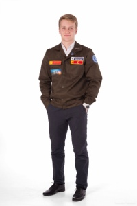

Денис Салистый

 Мне 24 года. Окончил бакалавриат Уральского федерального университета
по направлению "Электроэнергетика и электротехника".
Холост. 1 год проработал по специальности инженером в службе релейной защиты
и автоматики. 1 год 8 месяцев работаю менеджером по продажам в компании 
СКБ Контур.
Программирую на Swift. Пишу курсовую работу по Git

Навыки:
1. Навык работы в Git
2. Знаю принципы ООП
3. Умею работать в команде
4. Английский язык B2
 

